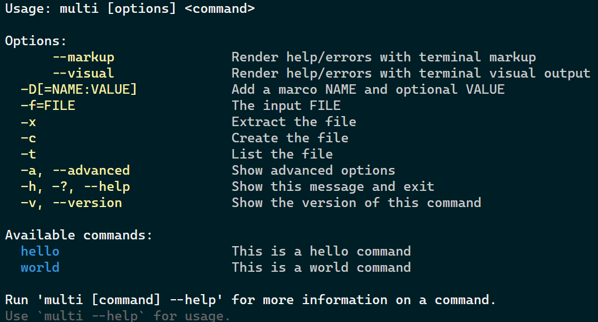
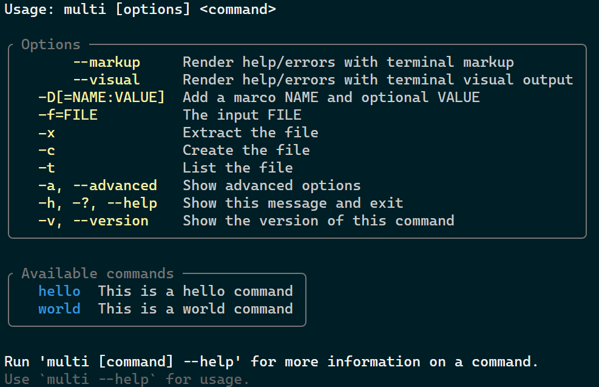
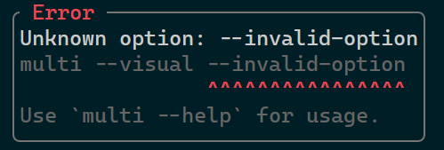

# XenoAtom.CommandLine [](https://github.com/XenoAtom/XenoAtom.CommandLine/actions/workflows/ci.yml)   [](https://www.nuget.org/packages/XenoAtom.CommandLine/)


**XenoAtom.CommandLine** is a lightweight, powerful and NativeAOT-friendly command-line parsing library for .NET

## ✨ Features

- **Lightweight and NativeAOT-friendly** (`net8.0`+), with **zero dependencies**
- **Composition-first API:** declare commands/options with collection initializers (**no attributes, no base classes, no required "command classes"**)
- **Auto-generated usage/help:** "what you declare is what you get"
- **Commands and sub-commands** (e.g. `git commit -m "message"`)
- **Strict positional arguments by default** (named args + remainder): `<arg>`, `<arg>?`, `<arg>*`, `<arg>+`, `<>`
- **Fast parsing:** optimized hot paths (**no regex**), **low GC allocations**
- **Powerful option parsing**
  - **Prefixes:** `-`, `--`, `/` (e.g. `-v`, `--verbose`, `/v`)
  - **Aliases:** `-v`, `--verbose`
  - **Bundled short options:** `-abc` == `-a -b -c` (tar/POSIX style)
  - **Values:** required `=` / optional `:` (e.g. `-o`, `-oVALUE`, `-o:VALUE`, `-o=VALUE`)
  - **Multiple values:** `-i foo -i bar`
  - **Key/value pairs:** `-DMACRO=VALUE`
- **Built-ins:** `--help` and `--version`
- **Environment variable fallbacks:** bind options to env vars (with optional delimiter splitting)
- **Option and argument validation:** built-in validators (`Validate.Range`, `Validate.NonEmpty`, `Validate.OneOf`, ...)
- **Option constraints:** declare mutually-exclusive and requires relationships between options
- **Test-friendly parse API:** inspect parse results via `CommandApp.Parse(...)` without invoking command actions
- **Pluggable output rendering:** replace built-in help/error/version/license rendering via `CommandConfig.OutputFactory`
  - Optional **`XenoAtom.CommandLine.Terminal`** package (`net10.0`) for colored markup output and Terminal.UI visual help (`TerminalVisualCommandOutput`, `Command.ToHelpVisual()`)
  - Inline Terminal.UI visuals can be declared directly in command initializers and are rendered by default, markup, and visual outputs
- **Better errors by default**
  - **Strict unknown `-` / `--` options** (`CommandConfig.StrictOptionParsing`)
  - **Helpful diagnostics:** suggestions + "inactive in this context" hints
  - Use `--` to pass values starting with `-` (e.g. `myexe -- -5`); `/mnt/home` is treated as a positional value (not an option)
- **Response files:** `@file.txt` (supports quotes, `#` comments, and basic escaping on non-Windows)
- **Conditional groups:** declare commands/options that are only active when a condition is met
- **Shell completions:** bash/zsh/fish/PowerShell via `CompletionCommands`, token protocol, optional value completions (`ValueCompleter`)

## 🧪 Example

```csharp
using System;
using XenoAtom.CommandLine;

const string _ = "";
string? name = null;
int age = 0;
List<(string, string?)> keyValues = new List<(string, string?)>();
List<string> messages = new List<string>();
List<string> commitFiles = new List<string>();

var commandApp = new CommandApp("myexe")
{
    new CommandUsage(),
    _,
    {"D:", "Defines a {0:name} and optional {1:value}", (key, value) =>
    {
        if (key is null) throw new CommandOptionException("The key is mandatory for a define", "D");
        keyValues.Add((key, value));
    }},
    {"n|name=", "Your {NAME}", v => name = v},
    {"a|age=", "Your {AGE}", (int v) => age = v},
    new HelpOption(),
    _,
    "Available commands:",
    new Command("commit")
    {
        _,
        "Options:",
        {"m|message=", "Add a {MESSAGE} to this commit", messages},
        new HelpOption(),
        _,
        "Arguments:",
        { "<files>*", "Files to commit", commitFiles },

        // Action for the commit command
        (ctx, _) =>
        {
            ctx.Out.WriteLine($"Committing with name={name}, age={age}");
            foreach (var message in messages)
            {
                ctx.Out.WriteLine($"Commit message: {message}");
            }
            foreach (var file in commitFiles)
            {
                ctx.Out.WriteLine($"Commit file: {file}");
            }
            return ValueTask.FromResult(0);
        }
    },
    // Default action if no command is specified
    (ctx, _) =>
    {
        ctx.Out.WriteLine($"Hello {name}! You are {age} years old.");
        if (keyValues.Count > 0)
        {
            foreach (var keyValue in keyValues)
            {
                ctx.Out.WriteLine($"Define: {keyValue.Item1} => {keyValue.Item2}");
            }
        }

        return ValueTask.FromResult(0);
    }
};

await commandApp.RunAsync(args);
```

Notes:
- `CommandUsage()` defaults to `Usage: {NAME} {SYNTAX}` and `{SYNTAX}` is derived from your declared options/commands/arguments.
- Positional arguments are strict by default: declare `<arg>` / `<arg>?` / `<arg>*` / `<arg>+`, or declare `<>` to forward remaining arguments to the command action.

Running `myexe --help` will output:

```
Usage: myexe [options] <command>

  -D[=name:value]            Defines a name and optional value
  -n, --name=NAME            Your NAME
  -a, --age=AGE              Your AGE
  -h, -?, --help             Show this message and exit

Available commands:
  commit
```

Running `myexe --name John -a50` will output:

```
Hello John! You are 50 years old.
```

Running `myexe --name John -a50 -DHello -DWorld=121` will output:

```
Hello John! You are 50 years old.
Define: Hello =>
Define: World => 121
```

Running `myexe commit --help` will output:

```
Usage: myexe commit [options] <files>*

Options:
  -m, --message=MESSAGE      Add a MESSAGE to this commit
  -h, -?, --help             Show this message and exit

Arguments:
  <files>*                   Files to commit
```

Running `myexe --name John -a50 commit --message "Hello!" --message "World!"` will output:

```
Committing with name=John, age=50
Commit message: Hello!
Commit message: World!
```

## 🎨 Terminal / Visual Output

For richer CLI output, use the optional `XenoAtom.CommandLine.Terminal` package:

```csharp
using XenoAtom.CommandLine;
using XenoAtom.CommandLine.Terminal;
using XenoAtom.Terminal.UI;
using XenoAtom.Terminal.UI.Controls;
using XenoAtom.Terminal.UI.Figlet;
using XenoAtom.Terminal.UI.Styling;

var app = new CommandApp("myexe", config: new CommandConfig
{
    OutputFactory = _ => new TerminalVisualCommandOutput()
})
{
    new CommandUsage(),
    new TextFiglet("XenoAtom")
        .Font(FigletPredefinedFont.Standard)
        .LetterSpacing(1)
        .TextAlignment(TextAlignment.Left)
        .Style(TextFigletStyle.Default with
        {
            ForegroundBrush = Brush.LinearGradient(
                new GradientPoint(0f, 0f),
                new GradientPoint(1f, 0f),
                [
                    new GradientStop(0f, Colors.DodgerBlue),
                    new GradientStop(0.5f, Colors.White),
                    new GradientStop(1f, Colors.Orange),
                ],
                mixSpaceOverride: ColorMixSpace.Oklab),
        }),
    "Options:",
    { "n|name=", "Your {NAME}", _ => { } },
    new HelpOption(),
    (ctx, _) => ValueTask.FromResult(0)
};
```

This package also provides `command.ToHelpVisual(...)` for embedding help in Terminal.UI apps.
For one-shot rendering, `Terminal.Write(...)` is lazily initialized and does not require an explicit terminal session.

Example of the advanced sample with markup help:



Example of the advanced sample with visual help:



Example of the advanced sample with an error:



## 📃 Documentation

| Guide | Description |
|---|---|
| [Getting Started](doc/getting-started.md) | Installation, first application, running and testing |
| [Options](doc/options.md) | Option prototypes, values, flags, aliases, bundling, key/value pairs, typed parsing |
| [Commands](doc/commands.md) | Commands, sub-commands, actions, and conditional groups |
| [Arguments](doc/arguments.md) | Positional arguments, cardinality, remainder arguments |
| [Validation & Constraints](doc/validation.md) | Value validation, mutually exclusive options, requires constraints |
| [Help & Output](doc/help-output.md) | Help text, `CommandUsage`, custom output rendering, Terminal package |
| [Advanced Topics](doc/advanced.md) | Parse API, shell completions, response files, configuration, environment variables, performance |

## 🏗️ Build

You need to install the [.NET 10 SDK](https://dotnet.microsoft.com/download/dotnet/10.0). Then from the root folder:

```console
$ dotnet build src -c Release
```

## 🪪 License

This software is released under the [BSD-2-Clause license](https://opensource.org/licenses/BSD-2-Clause).

It is a fork of the excellent [NDesk.Options](http://www.ndesk.org/Options)/[Mono.Options](https://tirania.org/blog/archive/2008/Oct-14.html) with significant improvements and new features.

The license also integrate the original MIT license from [Mono.Options](https://github.com/mono/mono/blob/main/mcs/class/Mono.Options/Mono.Options/Options.cs).

## 🤗 Author

Alexandre Mutel aka [xoofx](https://xoofx.github.io).
