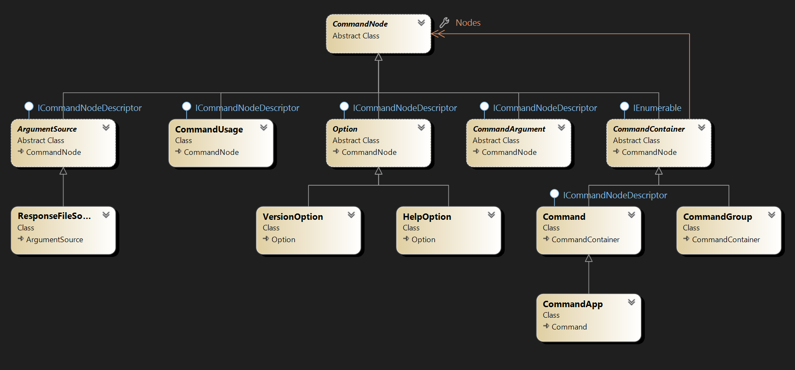

# Advanced Topics

This guide covers advanced features of XenoAtom.CommandLine: the parse API for testing, shell completions, response files, configuration, and performance.

## Parse API

`CommandApp.Parse(...)` runs the full parsing pipeline — option callbacks, argument binding, constraint checks — but **does not** invoke the command action. This is ideal for unit testing:

<!-- snippet: site_docs_advanced_md_001 -->
```cs
string? name = null;
int port = 0;

var app = new CommandApp("myexe")
{
    { "n|name=", "Your {NAME}", v => name = v },
    { "p|port=", "Server {PORT}", (int v) => port = v },
    new HelpOption(),
    (ctx, _) => ValueTask.FromResult(0)
};

var result = app.Parse(["--name", "Alice", "--port", "8080"]);

// result.HasErrors          → false
// result.ResolvedCommandPath → "myexe"
// result.OptionValues["name"][0] → "Alice"
// result.OptionValues["port"][0] → "8080"
// name → "Alice" (option callbacks are invoked)
// port → 8080
```
<!-- endSnippet -->

### ParseResult Properties

{.table}
| Property | Type | Description |
|---|---|---|
| `ResolvedCommand` | `Command` | The command that was resolved |
| `ResolvedCommandPath` | `string` | Full command path (e.g. `"myexe commit"`) |
| `OptionValues` | `IReadOnlyDictionary<string, IReadOnlyList<string?>>` | Parsed option values by name |
| `ArgumentValues` | `IReadOnlyList<string>` | Parsed positional argument values |
| `RemainingArguments` | `IReadOnlyList<string>` | Remaining unbound arguments |
| `Errors` | `IReadOnlyList<CommandException>` | Parse errors (empty on success) |
| `HasErrors` | `bool` | Whether any errors occurred |
| `HelpRequested` | `bool` | Whether `--help` was passed |
| `VersionRequested` | `bool` | Whether `--version` was passed |

### Parse Behavior

- Option and argument action callbacks **are** invoked during parsing.
- The command action is **not** invoked.
- Help/version requests are surfaced via `HelpRequested`/`VersionRequested`.
- Errors are collected in `Errors` instead of being written to stderr.
- If `runConfig` is null, `Out` and `Error` default to `TextWriter.Null` to suppress output.
- Parsing mutates per-run option state (`WasSet` tracking), so command graphs are intended for one invocation at a time.

### Invocation Concurrency Contract

- Command graphs are **not thread-safe for concurrent `RunAsync`/`Parse` calls** on the same command tree.
- Sequential invocations on the same graph are supported.
- Create separate command graph instances if you need true parallel invocations.

### Testing Sub-Commands

<!-- snippet: site_docs_advanced_md_002 -->
```cs
var result = app.Parse(["commit", "--message", "Hello"]);

// result.ResolvedCommandPath → "myexe commit"
// result.OptionValues["message"][0] → "Hello"
```
<!-- endSnippet -->

## Shell Completions

XenoAtom.CommandLine can generate shell completion scripts and provide completion candidates for partially typed command lines.

### Adding Completion Support

Add `CompletionCommands` to your app to expose completion commands:

<!-- snippet: site_docs_advanced_md_003 -->
```cs
var app = new CommandApp("myexe")
{
    new CompletionCommands(),
    { "n|name=", "Your {NAME}", v => {} },
    new HelpOption(),
    new Command("build", "Build the project") { (ctx, _) => ValueTask.FromResult(0) },
    (ctx, _) => ValueTask.FromResult(0)
};
```
<!-- endSnippet -->

This adds two sub-commands:
- `completion <shell>` (hidden) — generates the shell completion script
- `__complete` (hidden) — handles completion requests from the shell

Both commands are hidden from default help output, but callable directly.

### Installing Completions

Generate and source the completion script for your shell:

```sh
# Bash (current session)
eval "$(myexe completion bash)"

# Zsh (current session)
source <(myexe completion zsh)

# Fish (current session)
myexe completion fish | source

# PowerShell (current session)
myexe completion powershell | Out-String | Invoke-Expression
```

### Programmatic Completions

You can also get completion candidates programmatically:

<!-- snippet: site_docs_advanced_md_004 -->
```cs
var candidates = app.GetCompletions("myexe --na");
// → ["--name"]

var commandCandidates = app.GetCompletionsForTokens(["myexe", "buil"], tokenIndex: 1);
// → ["build"]
```
<!-- endSnippet -->

### Value Completions

Provide completion candidates for option and argument values:

<!-- snippet: site_docs_advanced_md_005 -->
```cs
app.Options["name"].ValueCompleter = static (index, prefix) =>
    ["Alice", "Bob", "Charlie"];

app.Arguments[0].ValueCompleter = static (index, prefix) =>
    ["README.md", "src/", "tests/"];
```
<!-- endSnippet -->

The `ValueCompleter` delegate receives:
- `index` — the 0-based value index being completed
- `prefix` — the partially typed text

### Completion Protocol

The shell scripts call the hidden `__complete` sub-command using one of two modes:

- **Token mode** (preferred): `myexe __complete --command-name <NAME> --index <N> --token <T1> --token <T2> ...`
- **Line mode** (fallback): `myexe __complete --command-name <NAME> --line <LINE> --cursor <POS>`

Completion is **non-executing** — it does not invoke user option actions. It only inspects the declared command tree.

## Response Files

Response files let users put arguments in a file and reference it with `@`:

### Enabling Response Files

Add `ResponseFileSource` to your command:

<!-- snippet: site_docs_advanced_md_006 -->
```cs
var app = new CommandApp("myexe")
{
    new HelpOption(),
    new ResponseFileSource(),
    { "<>", "Extra arguments" },
    (ctx, arguments) =>
    {
        foreach (var arg in arguments)
            ctx.Out.WriteLine(arg);
        return ValueTask.FromResult(0);
    }
};
```
<!-- endSnippet -->

Help output includes:

```
  @file                      Read response file for more options.
```

### Using Response Files

Create a response file (e.g. `args.txt`):

```
--name John
--port 8080
# This is a comment
"hello world"
```

Pass it with `@`:

```sh
myexe @args.txt
```

### Response File Syntax

{.table}
| Feature | Syntax | Example |
|---|---|---|
| Whitespace separation | spaces/tabs | `--name John` → `--name`, `John` |
| Quoted values | `"..."` or `'...'` | `"hello world"` → `hello world` |
| Comments | `#` at start of line | `# This is a comment` |
| Escaping (non-Windows) | `\` | `c\ d` → `c d` |
| Literal backslash (Windows) | `\` is literal | `C:\Temp\file.txt` → `C:\Temp\file.txt` |

### Custom Argument Sources

You can create your own argument source by extending `ArgumentSource`:

<!-- snippet: site_docs_advanced_md_007 -->
```cs
public class EnvironmentSource : ArgumentSource
{
    public override string Description => "Read arguments from environment";
    public override string[] GetNames() => ["@env"];
    public override bool TryGetArguments(string value, out IEnumerable<string>? arguments)
    {
        if (value.StartsWith("@env:"))
        {
            var envValue = Environment.GetEnvironmentVariable(value[5..]);
            arguments = envValue?.Split(' ') ?? [];
            return true;
        }
        arguments = null;
        return false;
    }
}
```
<!-- endSnippet -->

## Configuration

### CommandConfig

`CommandConfig` controls application-level behavior. It is set once when creating the `CommandApp`:

<!-- snippet: site_docs_advanced_md_008 -->
```cs
var config = new CommandConfig
{
    StrictOptionParsing = true,                    // default
    Localizer = s => s,                            // identity by default
    EnvironmentVariableResolver = Environment.GetEnvironmentVariable,  // default
    OutputFactory = runConfig => new MyOutputRenderer(),
};

var app = new CommandApp("myexe", config: config);
```
<!-- endSnippet -->

{.table}
| Property | Default | Description |
|---|---|---|
| `StrictOptionParsing` | `true` | Fail on unknown `-`/`--` tokens |
| `Localizer` | Identity | Transform all built-in strings (for localization) |
| `EnvironmentVariableResolver` | `Environment.GetEnvironmentVariable` | Customize env-var lookup |
| `OutputFactory` | `null` (uses `DefaultCommandOutput`) | Factory for custom output rendering |

### CommandRunConfig

`CommandRunConfig` controls runtime behavior for a specific invocation:

<!-- snippet: site_docs_advanced_md_009 -->
```cs
var runConfig = new CommandRunConfig(Width: 120, OptionWidth: 32)
{
    Out = Console.Out,
    Error = Console.Error,
    ShowLicenseOnRun = true,
};

await app.RunAsync(args, runConfig);
```
<!-- endSnippet -->

{.table}
| Property | Default | Description |
|---|---|---|
| `Width` | `80` | Terminal width for formatting |
| `OptionWidth` | `29` | Column width for option names in help |
| `Out` | `Console.Out` | Standard output writer |
| `Error` | `Console.Error` | Standard error writer |
| `ShowLicenseOnRun` | `true` | Whether to print the license header |

### Localization

Use `CommandConfig.Localizer` to translate all built-in strings:

<!-- snippet: site_docs_advanced_md_010 -->
```cs
var app = new CommandApp("myexe", config: new CommandConfig
{
    Localizer = text => MyLocalizationService.Translate(text),
});
```
<!-- endSnippet -->

The localizer is applied before strings are written to `Out`/`Error`.

### Environment Variable Resolution

Override environment variable lookup for testing or custom scenarios:

<!-- snippet: site_docs_advanced_md_011 -->
```cs
var envVars = new Dictionary<string, string> { ["MY_PORT"] = "8080" };

var app = new CommandApp("myexe", config: new CommandConfig
{
    EnvironmentVariableResolver = name => envVars.GetValueOrDefault(name),
});
```
<!-- endSnippet -->

## EnumWrapper

`EnumWrapper<T>` provides AOT-friendly enum parsing for options:

<!-- snippet: site_docs_advanced_md_012 -->
```cs
var colors = new List<Color>();

var app = new CommandApp("myexe")
{
    { "c|color=", "Console {COLOR} (" + EnumWrapper<Color>.Names + ")",
        (EnumWrapper<Color> v) => colors.Add(v) },
    (ctx, _) => ValueTask.FromResult(0)
};

enum Color { Red, Green, Blue }
```
<!-- endSnippet -->

`EnumWrapper<T>`:
- Implements `ISpanParsable<T>` for seamless integration with the option parser.
- Provides case-insensitive parsing.
- Has a static `Names` property returning a comma-separated list of valid values.
- Supports implicit conversion to and from the wrapped enum type.

## Performance

The parser is optimized for minimal allocations:

- No regex usage during parsing
- No per-option `string.Split` arrays
- Optimized hot paths for option lookup and value extraction

### Benchmarking

Run the included benchmarks:

```sh
dotnet run -c Release --project src/XenoAtom.CommandLine.Benchmarks
```

### NativeAOT Compatibility

XenoAtom.CommandLine is fully compatible with NativeAOT publishing:

- No runtime code generation, dynamic proxies, or runtime binding
- All types are trimmer-safe
- `EnumWrapper<T>` avoids runtime reflection for enum parsing
- Built-in defaults use only lightweight assembly metadata lookups (for example command name/version discovery)

Publish with NativeAOT:

```sh
dotnet publish -c Release -r win-x64 /p:PublishAot=true
```

## Class Diagram

The following diagram shows the main types and their relationships:



The design is intentionally simple. The main types are:

- **`CommandApp`** — entry point, inherits from `Command`
- **`Command`** — executable command with options, arguments, and sub-commands
- **`CommandGroup`** — conditional group of nodes
- **`Option`** — option with prototype, description, and callback
- **`CommandArgument`** — positional argument with cardinality
- **`HelpOption`** / **`VersionOption`** — built-in options
- **`ResponseFileSource`** — `@file` argument expansion
- **`CompletionCommands`** — shell completion support
- **`CommandUsage`** — usage text for help

All these types inherit from `CommandNode`, the base class for all command tree nodes. Container types (`Command`, `CommandApp`, `CommandGroup`) inherit from `CommandContainer` and support collection initializers.

## Next Steps

- [Getting Started](getting-started.md) — first application walkthrough
- [Options](options.md) — full option reference
- [Commands](commands.md) — sub-commands and groups
- [Arguments](arguments.md) — positional arguments
- [Validation & Constraints](validation.md) — validate values and constraints
- [Help & Output](help-output.md) — customize help rendering

